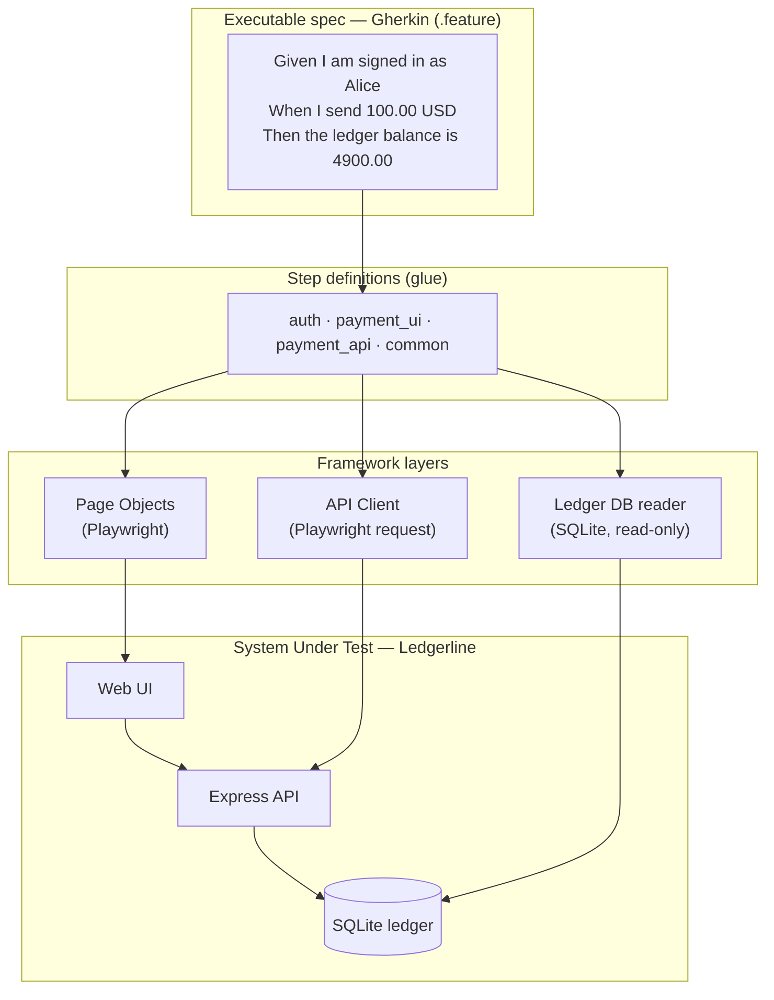

# Payments QA Automation Framework

[](https://github.com/AlqattanDev/payments-qa-framework/actions/workflows/ci.yml)
[](https://playwright.dev)
[](https://cucumber.io)
[](https://www.typescriptlang.org)

**▶ Live interactive demo: [exidex.dev/payments-qa](https://exidex.dev/payments-qa)** — watch a
test drive the app and verify the ledger, right in your browser.


An end-to-end test-automation framework built **from the ground up** for a fintech
payments platform. It drives a real (if small) payments app — sign-in, money
transfers, a validation gauntlet, a SQLite ledger — and verifies behaviour at
**three levels at once**: the browser UI, the HTTP API, and the database of record.

> It exists to demonstrate how I'd build and own a payment-platform test suite:
> readable specs non-engineers can review, a layered architecture that survives
> UI churn, and a CI pipeline that gates every change. The app under test
> (`Ledgerline`) is original and intentionally minimal — **the framework is the
> product here.**

---

## Why this shape

On a payments system, "the screen said it worked" is not enough — the **ledger**
has to agree. So every money-moving scenario asserts both the user-visible
outcome **and** the database state behind it, and checks the ledger's core
invariant: *a transfer never changes the total money in the system.*



The **test pyramid** is deliberate: many fast API/DB checks at the bottom, a
focused set of browser journeys at the top.

```
        ┌───────────────┐
        │   UI (browser)│   payment_transfer, payment_validation, authentication
        ├───────────────┤
        │   API (HTTP)  │   payments_api  ← faster, pins the contract & error codes
        ├───────────────┤
        │   DB (ledger) │   balance + "total unchanged" invariant behind every transfer
        └───────────────┘
```

## The stack, and why each tool

| Tool | Role here | Why |
|---|---|---|
| **Playwright** | Primary browser driver + API request client | Fast, flake-resistant auto-waiting, one tool for UI *and* API |
| **Cucumber (BDD)** | Executable specification in Gherkin | Scenarios read as plain English — reviewable by QA, devs, and business |
| **TypeScript** | Whole framework | Types catch selector/among-signature mistakes before a run |
| **SQLite + `better-sqlite3`** | Database-of-record assertions | Prove money actually moved, not just that a toast appeared |
| **Cypress** | Cross-tool smoke | Second runner over the same journey — proficiency evidence |
| **Selenium WebDriver** | Cross-tool smoke | The W3C-standard driver, for parity with legacy estates |
| **GitHub Actions** | CI gate | Typecheck + all suites on every push and PR |

### Tool coverage (the four the role names)

| Requirement | Where it lives |
|---|---|
| **Playwright** | `src/pages/*`, `src/api/*`, `src/support/*` — the core suite |
| **Cucumber** | `features/*.feature` + `features/step_definitions/*` |
| **Cypress** | `cypress/e2e/smoke.cy.js` |
| **Selenium** | `selenium/smoke.test.js` |

A deeper Selenium-vs-Cypress-vs-Playwright breakdown lives in
[`docs/tooling-comparison.md`](docs/tooling-comparison.md).

## Run it

```bash
npm ci
npx playwright install chromium      # one-time browser download

npm test                # the full Playwright + Cucumber suite (boots the app itself)
npm run test:smoke      # only @smoke scenarios
npm run test:api        # only the API-level scenarios
npm run test:cypress    # the Cypress cross-tool smoke
npm run test:selenium   # the Selenium cross-tool smoke
npm run typecheck       # strict TypeScript, no emit
```

`npm test` starts the app, runs every scenario headless, tears the app down, and
writes an HTML report to `reports/cucumber-report.html`. No "start the server
first" step — the suite owns its System Under Test.

To watch it in a real browser: `TEST_ENV=local npm test` (headed).

## What's covered

- **Authentication** — valid sign-in; wrong password rejected.
- **Transfers** — a valid payment updates the UI, the history, and the ledger;
  repeated transfers debit cumulatively; the system-wide total stays constant.
- **Validation gauntlet** (one scenario per guarded rule): same-account,
  unknown account, insufficient funds, currency mismatch, non-positive amount,
  short reference, unauthorized.
- **API contract** — status codes and machine-readable error codes for every
  rejection, asserted directly against HTTP.

## Concepts (so the design is legible)

- **BDD / Gherkin** — tests are written as `Given/When/Then` sentences in
  `.feature` files. The English *is* the test; step definitions bind each line to
  code. Business-readable, and living documentation that can't drift from reality.
- **Page Object Model** — every screen is a class (`LoginPage`, `DashboardPage`)
  that owns its selectors. When the UI changes, one file changes, not fifty tests.
- **The World** — Cucumber gives each scenario a fresh context object holding the
  browser page, API client, and scratch state. Fresh per scenario = no leakage.
- **Hooks & isolation** — `Before` each scenario spins up a clean browser context
  and **reseeds the ledger** to a known baseline, so tests are independent and
  parallel-safe. `After` a failure attaches a full-page screenshot as evidence.
- **The test pyramid** — push checks as low as they'll go: assert error codes at
  the API, invariants at the DB, and reserve the browser for true user journeys.
- **CI gate** — every push runs the typecheck and all suites; red blocks merge.

## Layout

```
app/                     System Under Test — the Ledgerline payments app
  server.js              Express API: auth, payments, validation
  db.js                  SQLite ledger (accounts, payments) + deterministic seed
  public/                Vanilla UI with stable data-testid hooks
src/
  config/env.ts          Per-environment config (local · ci · uat)
  pages/                 Page Objects (Playwright)
  api/                   Typed HTTP client
  db/LedgerDb.ts         Read-only ledger assertions
  support/               World, hooks, app lifecycle
features/                Gherkin specs + step definitions
cypress/ · selenium/     Cross-tool proficiency smokes
.github/workflows/ci.yml Typecheck + all suites
```

## Design notes

See [`docs/ARCHITECTURE.md`](docs/ARCHITECTURE.md) for the rationale: isolation
and determinism, the multi-environment story (`local → ci → uat`), why the DB
layer opens read-only, and how to extend the suite to a new tool or environment.

---

MIT licensed. The `Ledgerline` app and all data are fictional.
