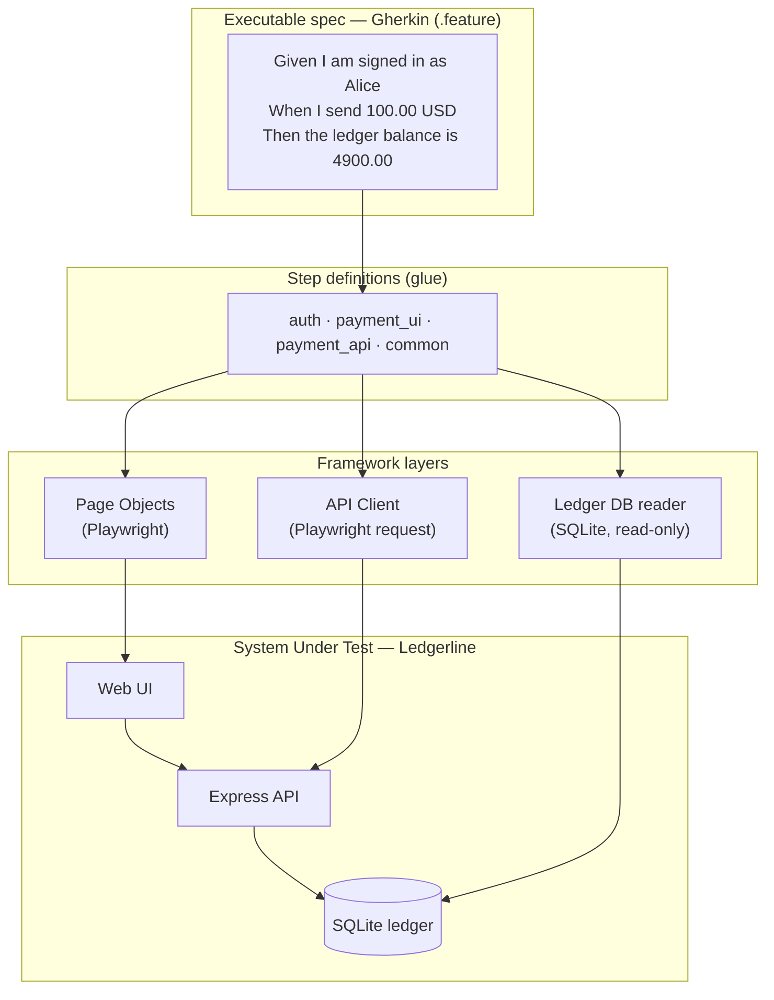

# Payments QA Automation Framework

[](https://github.com/AlqattanDev/payments-qa-framework/actions/workflows/ci.yml)
[](https://playwright.dev)
[](https://cucumber.io)
[](https://www.typescriptlang.org)

Interactive demo: [exidex.dev/payments-qa](https://exidex.dev/payments-qa)


End-to-end test automation for a fintech payments platform. The suite drives a
working payments app (sign-in, transfers, a set of validation rules, a SQLite
ledger) and checks behaviour at three levels: the browser UI, the HTTP API, and
the database of record.

The app under test, `Ledgerline`, is original and deliberately small. The
framework is the part worth reading.

## Why the DB layer is there

On a payments system, "the screen said it worked" is not enough. The ledger has
to agree. So every money-moving scenario asserts both the user-visible outcome
and the database state behind it, plus the ledger's core invariant: a transfer
never changes the total money in the system.



Checks sit as low in the pyramid as they can: error codes get asserted at the
API, invariants at the database, and the browser is reserved for real user
journeys.

## The stack

| Tool | Role here | Where |
|---|---|---|
| Playwright | Browser driver and API request client | `src/pages`, `src/api`, `src/support` |
| Cucumber | Executable specification in Gherkin | `features/*.feature` + `features/step_definitions` |
| TypeScript | The framework itself | `src/`, strict mode |
| better-sqlite3 | Read-only ledger assertions | `src/db/LedgerDb.ts` |
| Cypress | Cross-tool smoke over the same journey | `cypress/e2e/smoke.cy.js` |
| Selenium WebDriver | Cross-tool smoke over the same journey | `selenium/smoke.test.js` |
| GitHub Actions | Typecheck plus every suite on push and PR | `.github/workflows/ci.yml` |

Playwright is the primary driver because one library covers both the UI and the
HTTP calls, and its auto-waiting removes the usual source of flake. A longer
comparison against Selenium and Cypress is in
[`docs/tooling-comparison.md`](docs/tooling-comparison.md).

## Running it

```bash
npm ci
npx playwright install chromium      # one-time browser download

npm test                # full Playwright + Cucumber suite (boots the app itself)
npm run test:smoke      # only @smoke scenarios
npm run test:api        # only the API-level scenarios
npm run test:cypress    # Cypress cross-tool smoke
npm run test:selenium   # Selenium cross-tool smoke
npm run typecheck       # strict TypeScript, no emit
```

`npm test` starts the app, runs every scenario headless, tears the app down, and
writes an HTML report to `reports/cucumber-report.html`. There is no "start the
server first" step; the suite owns its system under test.

`TEST_ENV=local npm test` runs the same suite headed, if you want to watch it.

## What's covered

- Authentication: valid sign-in, wrong password rejected.
- Transfers: a valid payment updates the UI, the history, and the ledger;
  repeated transfers debit cumulatively; the system-wide total stays constant.
- Validation, one scenario per guarded rule: same-account, unknown account,
  insufficient funds, currency mismatch, non-positive amount, short reference,
  unauthorized.
- API contract: status codes and machine-readable error codes for every
  rejection, asserted directly against HTTP.

## Layout

```
app/                     System under test: the Ledgerline payments app
  server.js              Express API: auth, payments, validation
  db.js                  SQLite ledger (accounts, payments) + deterministic seed
  public/                Vanilla UI with stable data-testid hooks
src/
  config/env.ts          Per-environment config (local, ci, uat)
  pages/                 Page Objects
  api/                   Typed HTTP client
  db/LedgerDb.ts         Read-only ledger assertions
  support/               World, hooks, app lifecycle
features/                Gherkin specs + step definitions
cypress/ · selenium/     Cross-tool smokes
.github/workflows/ci.yml Typecheck + all suites
```

[`docs/ARCHITECTURE.md`](docs/ARCHITECTURE.md) covers the design decisions:
isolation and determinism, the `local → ci → uat` config story, why the DB layer
opens read-only, and how to extend the suite.

---

MIT licensed. The `Ledgerline` app and all data in it are fictional.
